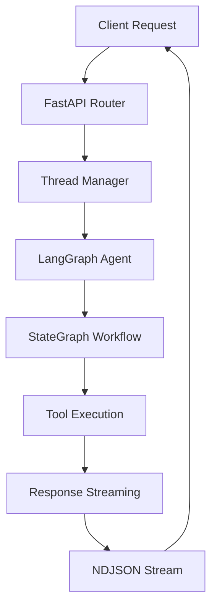

# FastAPI LangGraph Agent

A production-ready FastAPI application integrating LangGraph for building conversational AI agents with thread-based persistence, real-time streaming, and comprehensive conversation management.

## 🚀 Features

- **Thread-Based Persistence**: Maintain conversation state across multiple interactions with unique thread identifiers
- **Real-Time Token Streaming**: Stream AI responses token-by-token using NDJSON format for responsive user experience
- **LangGraph Integration**: ReAct agent architecture with tool integration and state management
- **Conversation Management**: Full thread lifecycle (create, retrieve, clear, archive)
- **Production Ready**: Comprehensive error handling, logging, and monitoring
- **Extensible Architecture**: Easy to add custom tools and modify agent behavior

## 🏗️ Architecture



### Core Components

1. **Agent System** (`fastapi_langraph/agent/`)
   - ReAct agent with LangGraph state management
   - Tool integration for extending capabilities
   - Context window management (max 20 messages)
   - Custom ToolNode implementation for compatibility

2. **API Layer** (`fastapi_langraph/api/`)
   - RESTful endpoints for chat and thread management
   - NDJSON streaming for real-time responses
   - Comprehensive error handling

3. **Thread Persistence**
   - In-memory MemorySaver (development)
   - Thread-based conversation checkpointing
   - Full conversation history retrieval

## 📦 Installation

### Prerequisites

- Python 3.11+
- Poetry for dependency management
- OpenAI API key

### Setup

1. **Clone the repository**
```bash
git clone https://github.com/posgnu/gigr-agent.git
cd gigr-agent
```

2. **Install dependencies**
```bash
poetry install
```

3. **Configure environment**
```bash
# Create .env file
cat > .env << EOF
OPENAI_API_KEY=your-openai-api-key
PROJECT_NAME=FastAPI-LangGraph
DESCRIPTION=LangGraph Agent with Streaming
LOG_LEVEL=INFO
EOF
```

4. **Run the development server**
```bash
poetry run uvicorn fastapi_langraph.main:app --reload
```

The server will start at `http://localhost:8000` with:
- API Documentation: `http://localhost:8000/docs`
- Service Info: `http://localhost:8000/info`

## 🔌 API Endpoints

### Chat Streaming

#### `POST /chat/stream`
Stream conversational responses with thread persistence.

**Request:**
```json
{
  "input": "Hello, how can you help me?",
  "thread_id": "optional-thread-id",
  "session_metadata": {
    "user": "user123",
    "context": "support"
  }
}
```

**Response Stream (NDJSON):**
```json
{"type":"metadata","thread_id":"abc-123","metadata":{"thread_created":true}}
{"type":"token","content":"Hello","thread_id":"abc-123"}
{"type":"token","content":"!","thread_id":"abc-123"}
{"type":"metadata","thread_id":"abc-123","metadata":{"status":"completed"}}
```

### Thread Management

- `GET /threads/{thread_id}/history` - Retrieve full conversation history
- `DELETE /threads/{thread_id}` - Delete thread and all messages
- `PUT /threads/{thread_id}/clear` - Clear thread messages (keep thread)
- `PUT /threads/{thread_id}/archive` - Archive thread

### Service Information

- `GET /info` - Service metadata and capabilities

## 🧪 Testing

### Interactive Testing
```bash
# Use the included chat client
poetry run python scripts/chat.py
```

### API Testing
```python
import requests
import json

# Test streaming endpoint
response = requests.post(
    'http://localhost:8000/chat/stream',
    json={'input': 'Hello!'},
    stream=True
)

for line in response.iter_lines():
    if line:
        data = json.loads(line)
        if data['type'] == 'token':
            print(data['content'], end='', flush=True)
```

## 🛠️ Development

### Project Structure
```
gigr-agent/
├── fastapi_langraph/
│   ├── agent/
│   │   ├── agent.py           # ReAct agent implementation
│   │   └── tools/             # Agent tools
│   │       └── mock_search.py # Example search tool
│   ├── api/
│   │   ├── routes.py          # API route aggregation
│   │   └── routers/           # Individual routers
│   │       ├── chat.py        # Chat streaming endpoints
│   │       ├── system.py      # System info endpoints
│   │       └── threads.py     # Thread management
│   ├── core/
│   │   └── config.py          # Application configuration
│   ├── middleware/
│   │   └── logging.py         # Request/response logging
│   ├── schemas.py             # Pydantic models
│   └── main.py                # FastAPI application
├── scripts/
│   └── chat.py                # Interactive chat client
├── tests/                     # Test suite
├── CLAUDE.md                  # AI assistant instructions
├── pyproject.toml             # Dependencies and configuration
└── README.md                  # This file
```

### Adding Custom Tools

1. Create a new tool in `fastapi_langraph/agent/tools/`:
```python
from langchain_core.tools import tool

@tool
def your_custom_tool(query: str) -> str:
    """Description of what your tool does."""
    # Tool implementation
    return result
```

2. Register the tool in `agent.py`:
```python
from fastapi_langraph.agent.tools.your_tool import your_custom_tool

class ReActAgent:
    def __init__(self):
        self.tools = [mock_search, your_custom_tool]
```

### Configuration

Environment variables in `.env`:
```bash
OPENAI_API_KEY=sk-...              # Required
PROJECT_NAME=YourProject           # Optional
DESCRIPTION=Your description       # Optional
LOG_LEVEL=INFO                     # DEBUG, INFO, WARNING, ERROR
```

Agent configuration in `agent.py`:
- Model: `gpt-4o-mini` (configurable)
- Temperature: `0.1` (low for consistency)
- Max context: 20 messages
- Streaming: Enabled

### Updating Model Configuration

To change the LLM model or its configuration, modify the initialization in `fastapi_langraph/agent/agent.py`:

```python
# In the ReActAgent.__init__ method, line 76:
self.llm = ChatOpenAI(
    model="gpt-4o-mini",     # Change model here (e.g., "gpt-4", "gpt-3.5-turbo")
    temperature=0.1,         # Adjust temperature (0.0-2.0)
    streaming=True,          # Enable/disable streaming
    max_tokens=1000,         # Optional: Set max response tokens
    request_timeout=60       # Optional: Set timeout in seconds
)
```

Available OpenAI models:
- `gpt-4o-mini` - Fast, cost-effective (default)
- `gpt-4o` - Most capable, balanced
- `gpt-4-turbo` - Previous generation turbo
- `gpt-3.5-turbo` - Fastest, least expensive

Temperature settings:
- `0.0-0.3` - Focused, deterministic responses
- `0.4-0.7` - Balanced creativity
- `0.8-2.0` - More creative, varied responses
