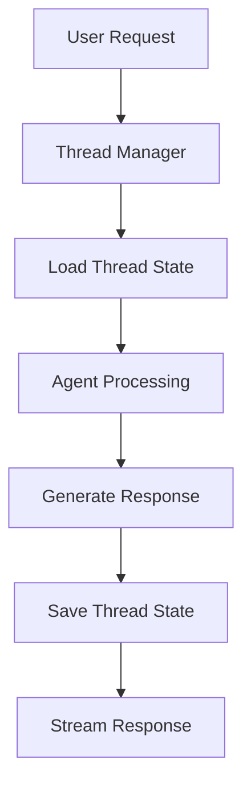

# FastAPI LangGraph Template

A production-ready template for building enterprise-grade FastAPI applications with LangGraph integration, featuring streaming conversational AI agents with thread-based persistence and conversation management.

## 🎯 What This Template Provides

- **Thread-Based Conversations**: Ready-to-use persistent conversation threads with unique identifiers
- **Token-Level Streaming**: Real-time response streaming with WebSocket-like experience
- **Enterprise-Grade Error Handling**: Comprehensive error handling and logging infrastructure
- **Thread Management**: Complete thread lifecycle management (create, retrieve, clear, archive)
- **RESTful API**: Well-designed API structure following enterprise patterns
- **Type Safety**: Full TypeScript-style type annotations with Pydantic models

## 🏗️ Template Architecture

### Persistence Strategy

This template implements thread-based persistence using LangGraph's MemorySaver pattern:

- **Thread Checkpoints**: Each conversation thread maintains its state
- **Conversation Continuity**: Threads can be resumed exactly where they left off
- **Message History**: Complete conversation history retrieval for any thread



## 🚀 Getting Started with This Template

### 1. Use This Template

```bash
# Create a new repository from this template
# Click "Use this template" on GitHub, or clone directly:
git clone https://github.com/posgnu/fastapi-langraph.git your-project-name
cd your-project-name

# Rename the project
# Update pyproject.toml, README.md, and other references as needed
```

### 2. Environment Setup

```bash
# Create environment file
cp .env.example .env
# Add your OPENAI_API_KEY and customize other settings

# Install dependencies
poetry install
```

### 3. Customize Your Agent

Edit `fastapi_langraph/agent/` to implement your specific agent logic:

```python
# Example: Customize the agent behavior
# In fastapi_langraph/agent/tools/
# Add your custom tools and capabilities
```

### 4. Start Development Server

```bash
poetry run uvicorn fastapi_langraph.main:app --reload
```

The server will start at `http://localhost:8000` with:
- API Documentation: `http://localhost:8000/docs`
- Service Info: `http://localhost:8000/info`

### 5. Test Your Implementation

```bash
# Use the included chat client to test your agent
poetry run python scripts/chat.py
```

## 📚 Template API Structure

This template provides a complete API structure that you can build upon:

### Core Chat Endpoints

#### `POST /chat/stream` - Stream Chat with Persistence
Stream conversational responses with thread persistence.

**Request Format:**
```json
{
  "input": "Your user message here",
  "thread_id": "optional-thread-id",
  "session_metadata": {
    "client": "your_app",
    "timestamp": "2024-01-01T00:00:00Z"
  }
}
```

**Response Stream Format:**
```json
{"type": "metadata", "thread_id": "abc-123", "metadata": {"thread_created": true}}
{"type": "token", "content": "Response", "thread_id": "abc-123"}
{"type": "metadata", "thread_id": "abc-123", "metadata": {"status": "completed"}}
```

### Thread Management Endpoints

- `GET /threads/{thread_id}/history` - Retrieve conversation history
- `DELETE /threads/{thread_id}` - Delete thread and history
- `PUT /threads/{thread_id}/clear` - Clear thread messages
- `PUT /threads/{thread_id}/archive` - Archive thread (customize as needed)

### Service Information

- `GET /info` - Service information and capabilities

## 🛠️ Customization Guide

### 1. Agent Customization

Replace the default agent implementation in `fastapi_langraph/agent/`:

```python
# Example: Custom agent with your tools
from your_tools import CustomTool1, CustomTool2

def create_your_agent():
    # Implement your agent logic here
    return agent
```

### 2. Add Custom Tools

Extend the tools directory:

```bash
# Add your tools in fastapi_langraph/agent/tools/
touch fastapi_langraph/agent/tools/your_custom_tool.py
```

### 3. Database Integration

Replace the in-memory storage with your preferred database:

```python
# For SQLite
from langgraph.checkpoint.sqlite import SqliteSaver
checkpointer = SqliteSaver("./your_app.db")

# For PostgreSQL
from langgraph.checkpoint.postgres import PostgresSaver
checkpointer = PostgresSaver(connection_string="postgresql://...")
```

### 4. Middleware Customization

Add your middleware in `fastapi_langraph/middleware/`:

```python
# Example: Authentication, rate limiting, etc.
@app.middleware("http")
async def your_custom_middleware(request: Request, call_next):
    # Your middleware logic
    pass
```

### 5. API Customization

Extend or modify the API routers in `fastapi_langraph/api/routers/`:

```python
# Add your custom endpoints
@router.post("/your-custom-endpoint")
async def your_endpoint():
    # Your endpoint logic
    pass
```

## 🚀 Production Deployment

### 1. Update Configuration

```python
# Update fastapi_langraph/core/config.py
class Settings(BaseSettings):
    project_name: str = "Your Project Name"
    description: str = "Your project description"
    # Add your custom settings
```

### 2. Choose Your Persistence Backend

```python
# Production-ready persistence options
# SQLite for small-scale
# PostgreSQL for enterprise scale
# Redis for caching
```

### 3. Add Monitoring

```python
# Add your monitoring solution
# Prometheus, DataDog, New Relic, etc.
```

## 🧪 Testing Your Implementation

### Unit Tests
```bash
# Add your tests in tests/
poetry run pytest tests/
```

### Integration Testing
```bash
# Test your customized endpoints
curl -X POST "http://localhost:8000/chat/stream" \
     -H "Content-Type: application/json" \
     -d '{"input": "Test your agent", "thread_id": "test-thread"}' \
     --no-buffer
```

### Chat Client Testing
```bash
# Use the included interactive client
poetry run python scripts/chat.py
```

## 📁 Template Structure

```
your-project/
├── fastapi_langraph/          # Main application package
│   ├── agent/                 # Agent implementation (customize this)
│   │   └── tools/            # Agent tools (add your tools here)
│   ├── api/                   # API layer
│   │   └── routers/          # API routers (extend as needed)
│   ├── core/                  # Core configuration and utilities
│   └── middleware/            # Custom middleware
├── scripts/                   # Utility scripts
├── tests/                     # Test suite (add your tests)
├── pyproject.toml            # Dependencies (update for your project)
└── README.md                 # This file (customize for your project)
```

## 🔧 Configuration

### Environment Variables

```bash
# Required
OPENAI_API_KEY=your-openai-api-key

# Customize these for your project
PROJECT_NAME=Your-Project-Name
DESCRIPTION=Your project description
LOG_LEVEL=INFO
MAX_CONVERSATION_LENGTH=20
```

### Agent Configuration

```python
# Customize in fastapi_langraph/core/config.py
AGENT_CONFIG = {
    "model": "gpt-4o-mini",  # Choose your model
    "temperature": 0.1,       # Adjust for your use case
    "max_context_messages": 20,
    "streaming": True
}
```

## 🎯 Next Steps

1. **Clone/Fork** this template
2. **Customize** the agent logic for your use case
3. **Add** your specific tools and capabilities
4. **Configure** your persistence backend
5. **Deploy** to your preferred platform
6. **Monitor** and iterate

## 🤝 Contributing to the Template

Improvements to this template are welcome:

1. Fork the template repository
2. Create a feature branch
3. Add comprehensive tests
4. Follow the existing code style
5. Submit a pull request

## 📄 License

MIT License - see LICENSE file for details.

## 🆘 Support

- **Issues**: Submit GitHub issues for template bugs and improvements
- **Discussions**: Use GitHub Discussions for questions about using this template

---

**⭐ Star this template if it helps you build amazing AI applications!**

**Built with ❤️ using FastAPI, LangGraph, and OpenAI**
